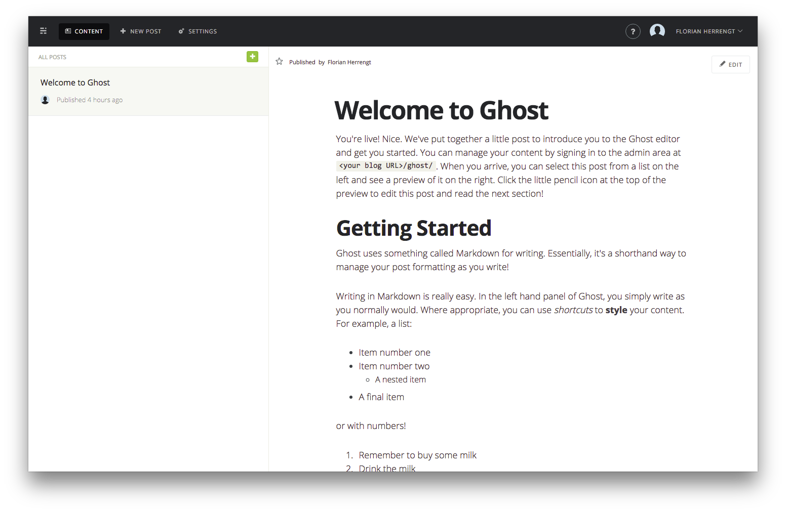
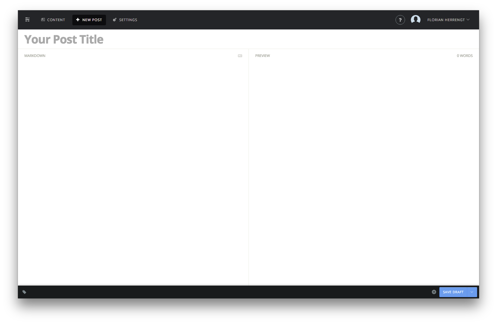
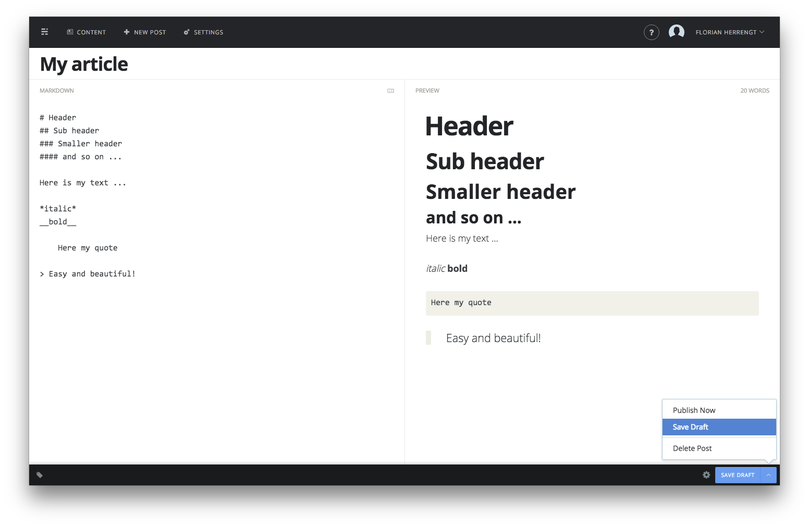
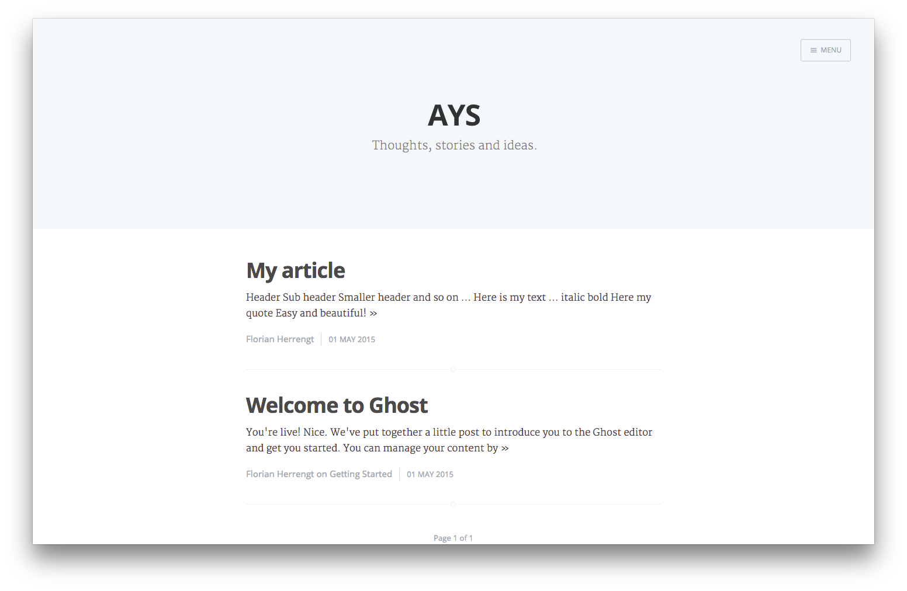
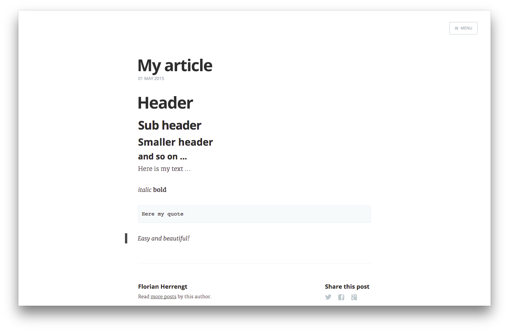
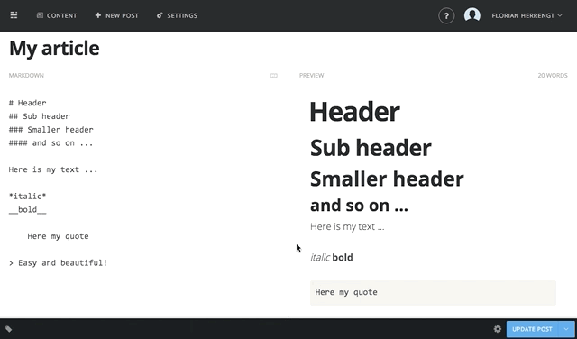

# Hosted by Ghost #
 Views | Price
 ----- | ------------
25k   | 8$ (~£5)
100k  | 24$ (~£16)
350k  | 80$ (~£55)
1000k | 200$ (~£135)

- Unlimited transfer and storage
- Automatic updates and backups
- Upload any theme or app
- Worldwide CDN & security protection

# Self-hosted #
### ToDo ###
- Database
- Mail configuration
- Manage upgrade
- Setup SSL
- nginx
- deploying (docker?)

### Known difficulties ###
- SQLite3
- Upload images

# Getting started #
- Get the docker image: `docker pull ghost`
- Go into the root directory (mount the docker volume)
- Open `config.js`
- Add your email credentials to `config.development.mail`

Example with gmail:

    mail: {
        transport: 'SMTP',
        options: {
          service: 'gmail',
          auth: {
            user: 'user.name@adjustyourset.com',
            pass: 'secret'
          }
        }
      },

- Go to `http://<dockerip>:<app_port>/ghost/setup/`
- Then `http://<dockerip>:<app_port>/ghost/signin/`

### Get user from a controller ###

    var Models = require('../models');
    Models.User.findOne({ id: 1}).then(function(foundUser){
        console.log(foundUser.toJSON());
    };

Note: Ghost uses passport

### How does it look like? ###

### But I don't know markdown ###
You can bring the `Markdown Help`

